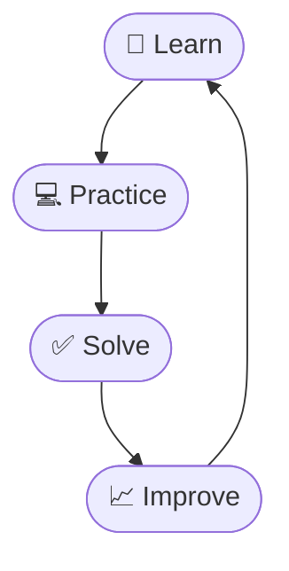

<div align="center">

# 💻 HackerRank Solutions


<br/>


<br/>

<b>🚀 My coding practice, problem-solving journey, and HackerRank solutions.</b>

<br/><br/>


</div>

---

## 📑 Table of Contents

<p align="center">

[About](#-about-this-repository) • [Progress](#-problem-solving-progress) • [Tools](#️-languages--tools) • [Topics](#-topics-covered) • [Java](#-java-solutions) • [Python](#-python-solutions) • [C](#-c-programming-solutions) • [SQL](#️-sql-solutions) • [Structure](#-repository-structure) • [Roadmap](#-future-roadmap) • [Stats](#-github-stats)

</p>

---

## 🧠 About This Repository

Welcome to my **HackerRank Solutions Repository** 🚀

This repository contains my solutions to programming problems solved while practicing on **HackerRank**.

The main objective is to strengthen my programming fundamentals, improve logical thinking, and build strong problem-solving skills for technical interviews and real-world development.

<table align="center">
<tr>
<td align="center">🧠<br/><b>Improve</b><br/>Problem-Solving</td>
<td align="center">💻<br/><b>Strengthen</b><br/>Fundamentals</td>
<td align="center">📚<br/><b>Practice</b><br/>DSA</td>
<td align="center">🗃️<br/><b>Sharpen</b><br/>SQL Skills</td>
<td align="center">🎯<br/><b>Prepare</b><br/>Interviews</td>
<td align="center">🚀<br/><b>Stay</b><br/>Consistent</td>
</tr>
</table>

<p align="center">

**Learn → Practice → Solve → Improve → Repeat 🔥**

</p>

---

## 📊 Problem Solving Progress

<div align="center">

| Language | Solved | Progress |
| :---: | :---: | :--- |
| ☕ **Java** | `0` |  |
| 🐍 **Python** | `0` |  |
| 🔵 **C** | `0` |  |
| 🗄️ **SQL** | `0` |  |
| 🏆 **Total** | `0` |  |

</div>

> 📌 **Note:** Problem counts will be updated as new HackerRank solutions are added.

---

## 🛠️ Languages & Tools

<p align="center">
  
</p>

<p align="center">

`Java` • `Python` • `C` • `SQL` • `Git` • `GitHub` • `VS Code`

</p>

---

## 📚 Topics Covered

<table>
<tr>
<td valign="top" width="25%">

### 💡 Fundamentals
- Variables & Data Types
- Operators
- Conditional Statements
- Loops
- Functions
- Input & Output

</td>
<td valign="top" width="25%">

### 📦 Data Structures
- Arrays
- Strings
- Linked Lists
- Stacks
- Queues
- Hashing
- Trees
- Graphs

</td>
<td valign="top" width="25%">

### 🧠 Algorithms
- Searching
- Sorting
- Recursion
- Two Pointers
- Sliding Window
- Greedy Algorithms
- Dynamic Programming

</td>
<td valign="top" width="25%">

### 🗃️ SQL
- SELECT / WHERE
- ORDER BY
- GROUP BY / HAVING
- DISTINCT
- JOINs
- Subqueries

</td>
</tr>
</table>

---

## ☕ Java Solutions

<p align="center">
  
</p>

| Topic | Problems |
| :--- | :---: |
| Basics | 0 |
| Arrays | 0 |
| Strings | 0 |
| OOP | 0 |
| Recursion | 0 |
| Algorithms | 0 |

📁 **Folder:** [`Java/`](./Java)

---

## 🐍 Python Solutions

<p align="center">
  
</p>

| Topic | Problems |
| :--- | :---: |
| Basics | 0 |
| Arrays | 0 |
| Strings | 0 |
| Functions | 0 |
| OOP | 0 |

📁 **Folder:** [`Python/`](./Python)

---

## 🔵 C Programming Solutions

<p align="center">
  
</p>

| Topic | Problems |
| :--- | :---: |
| Basics | 0 |
| Arrays | 0 |
| Strings | 0 |
| Functions | 0 |
| Pointers | 0 |

📁 **Folder:** [`C/`](./C)

---

## 🗄️ SQL Solutions

<p align="center">
  
</p>

| Level | Problems |
| :--- | :---: |
| Basic | 0 |
| Intermediate | 0 |
| Advanced | 0 |

📁 **Folder:** [`SQL/`](./SQL)

---

## 📁 Repository Structure

```text
HackerRank-Solution/
│
├── 📄 README.md
│
├── ☕ Java/
│   ├── Basics/
│   ├── Arrays/
│   ├── Strings/
│   └── OOP/
│
├── 🐍 Python/
│   ├── Basics/
│   ├── Arrays/
│   └── Strings/
│
├── 🔵 C/
│   ├── Basics/
│   ├── Arrays/
│   └── Strings/
│
└── 🗄️ SQL/
    ├── Basic/
    ├── Intermediate/
    └── Advanced/
```

---

## 📈 Coding Journey

<div align="center">



</div>

---

## 🏆 HackerRank Practice

<p align="center">
  
  
  
</p>

> 💡 **Every problem solved is one step closer to becoming a better developer.**

---

## 📌 Future Roadmap

- [ ] Complete Programming Basics
- [ ] Solve 50+ HackerRank Problems
- [ ] Solve 100+ HackerRank Problems
- [ ] Master Arrays & Strings
- [ ] Master Data Structures
- [ ] Practice Algorithms
- [ ] Complete SQL Challenges
- [ ] Improve Problem-Solving Speed
- [ ] Prepare for Technical Interviews

---

## 💻 Development Philosophy

<p align="center">

### *"Don't just write code. Understand the problem."*

</p>

I believe consistent practice is the key to becoming a strong programmer. This repository will continuously evolve as I solve more problems, learn new concepts, and improve my coding skills.

---

## 📊 GitHub Stats

<p align="center">
  
  
</p>

<p align="center">
  
</p>

---

## 🐍 Contribution Activity

<p align="center">
  
</p>

---

<div align="center">

## ⭐ Support This Repository

If you find this repository useful, consider giving it a ⭐ — it helps and keeps me motivated!

### 🚀 Keep Coding. Keep Learning. Keep Growing.

**Made with ❤️ & ☕ by Ashutosh Kushwaha**


</div>
